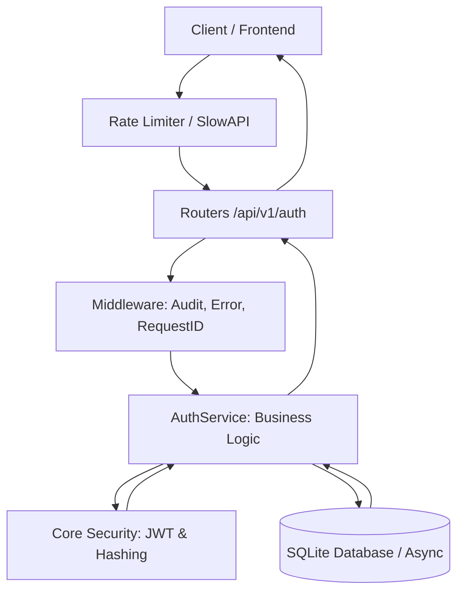

# 🔐 Secure Auth API: High-Maturity Asynchronous Identity Protection

I built this production-ready authentication backend with FastAPI to demonstrate how to implement industry-standard security patterns in an asynchronous Python environment.

## 🌟 About the Developer
Hello! I'm **Ezequiel Ranieri**. I am a self-taught developer who discovered the world of programming through curiosity and a passion for building things. Everything I know—from architecture patterns to distributed systems—I've learned on my own through books, technical documentation, videos, and endless hours of practice.

I created this project to consolidate and demonstrate my understanding of software development. I don't claim to be a senior architect; I am a dedicated learner who enjoys solving complex technical challenges and building robust software that works under pressure.

**Contact:**
- **Email:** ez.ranieri@gmail.com
- **GitHub:** https://github.com/ezequielranieri
- **LinkedIn:** https://www.linkedin.com/in/ezequielranieri/

---

## 🎯 Why this project?
I built this project to move beyond basic JWT tutorials and explore the complexities of building a resilient security layer. My main goal was to solve critical identity problems like token hijacking and brute force attacks. I wanted to see how far I could push FastAPI's performance while maintaining a "Security-First" architecture, implementing advanced features like token rotation and granular rate limiting.

## 🏗 System Architecture / Data Flow
My project follows a layered architecture to ensure a clean separation of concerns:

1.  **Rate Limiting Layer**: Every request first hits SlowAPI to prevent endpoint abuse.
2.  **Middleware Stack**: I handle Request IDs for traceability and structured audit logging before reaching the logic.
3.  **Router Layer**: I manage HTTP validation and status codes using Pydantic schemas.
4.  **Service Layer**: This is where I centralize the business logic, orchestrating database transactions and security primitives.
5.  **Security Core**: I utilize Bcrypt for hashing and Jose for JWT management, ensuring cryptographic integrity.
6.  **Persistence Layer**: I use SQLAlchemy 2.0 with full `asyncio` support to handle data operations without blocking.



## 🛠 Tech Stack
- **FastAPI**: Used as the high-performance asynchronous web framework.
- **SQLAlchemy 2.0**: Employed as the async ORM for robust database interaction.
- **Pydantic v2**: Utilized for strict data validation and settings management.
- **Alembic**: I use this to handle database migrations and versioning.
- **Passlib (Bcrypt)**: Implemented for secure, hardware-resilient password hashing.
- **SlowAPI**: Integrated to provide granular rate limiting per IP and endpoint.
- **Structlog**: Used to generate structured, JSON-ready logs for observability.

---

## 🚀 Quick Start Guide

**Prerequisites:** Python 3.12+

1.  **Clone and setup**:
    ```bash
    git clone https://github.com/ezequielranieri/secure-auth-api.git
    cd secure-auth-api
    cp .env.example .env  # Configure your SECRET_KEY here
    ```

2.  **Install dependencies**:
    ```bash
    pip install -e .
    # For testing: pip install -e ".[dev]"
    ```

3.  **Prepare database**:
    ```bash
    alembic upgrade head
    ```

4.  **Run the application**:
    ```bash
    uvicorn src.auth.main:app --reload
    ```

## 💡 Usage / Endpoints
The API documentation is automatically available at `/api/v1/docs`.

- `POST /api/v1/auth/register`: Create a new account (Rate limited).
- `POST /api/v1/auth/login`: Authenticate and receive Access + Refresh tokens.
- `POST /api/v1/auth/refresh`: Rotate tokens using a valid Refresh Token.
- `POST /api/v1/auth/logout`: Revoke the current session.
- `GET /api/v1/users/me`: Access your secure profile (Requires Bearer Token).

---

## 🧠 What I Learned
Developing this project taught me the importance of treating security as a core architectural pillar rather than an afterthought. I gained deep experience in asynchronous database patterns and the nuances of JWT-based session management, specifically around token revocation.

**Self-Critique & Modern Improvements:**
Looking back at the code today, I identified some areas where my younger self was less efficient:
- **Token Verification Bottleneck**: My current refresh logic iterates through a user's active tokens and hashes them in a loop to find a match. This is `O(n)` and computationally heavy. Today, I would store the `jti` (JWT ID) in a fast-lookup index or use a secure hash lookup in the DB to make this `O(1)`.
- **Static Service Methods**: I used `@staticmethod` for my `AuthService`. While simple, it makes unit testing harder. I would now refactor this to use FastAPI's Dependency Injection system to inject service instances.
- **Database Scalability**: Using SQLite was great for simplicity, but for a production identity system, I would migrate to PostgreSQL to handle concurrent writes and better locking mechanisms.

## 🗺 Roadmap
- [ ] Migrate to PostgreSQL for better production scalability.
- [ ] Implement Two-Factor Authentication (2FA) via TOTP.
- [ ] Integrate a proper Secrets Manager for environment variables.

Thank you for checking out my work! I'm always open to feedback and looking for new opportunities to learn and grow.
