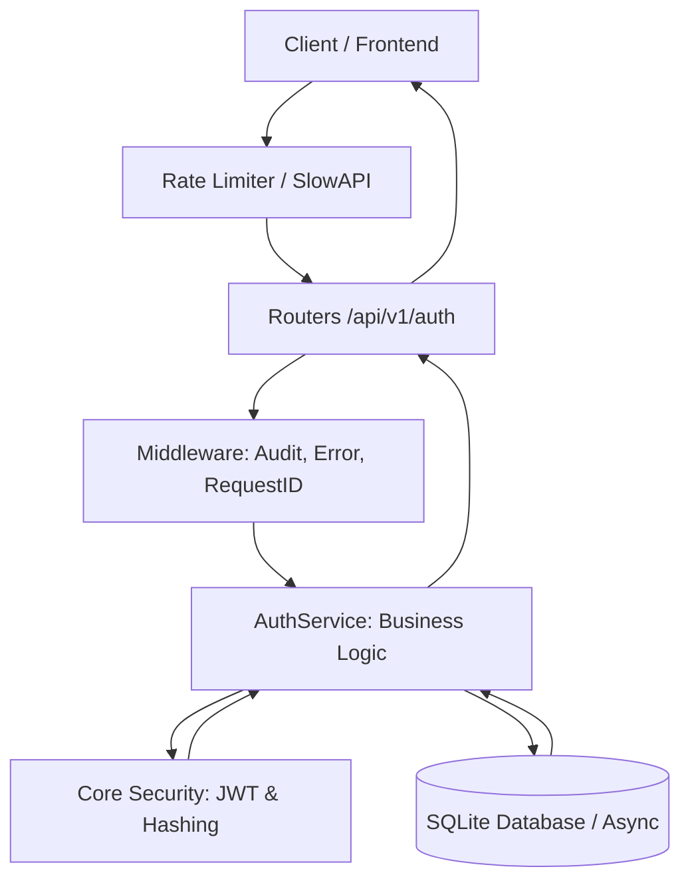

# 🔐 Secure Auth API

I built this asynchronous REST API with a strict 'Security-First' mindset using FastAPI. My goal was to move beyond the basic authentication patterns found in most tutorials and implement high-maturity identity protection mechanisms that mitigate real-world threats in real-time.

## 👤 About Me
I am Ezequiel Ranieri, a developer focused on writing clean, scalable code and building solutions that adhere to rigorous security standards. This project is a key part of my technical portfolio, reflecting my approach to neutralizing common vulnerabilities in identity systems and my commitment to backend resilience.

## 🎯 Why I built this?
Identity management is the most critical and frequently attacked component of any software system. I designed this project to demonstrate how to implement robust countermeasures against replay attacks, brute force attempts, and endpoint abuse (DoS) using modern, asynchronous tools in the Python ecosystem. To me, security isn't a feature—it's the core of the architecture.

## ✨ Key Features
*   **Robust Authentication:** I manage sessions via JWT with short-lived Access Tokens and persistent Refresh Tokens to minimize the window of exposure.
*   **Token Rotation:** I implemented a rotation logic where every use of a Refresh Token generates a new pair and immediately invalidates the old one, effectively neutralizing session hijacking and replay attempts.
*   **Brute Force Protection:** My system automatically triggers a temporary account lockout after 5 consecutive failed attempts, enforcing a 15-minute cooldown to stop automated password-guessing bots.
*   **Granular Rate Limiting:** I integrated SlowAPI to protect sensitive endpoints by IP. For instance, I've restricted registration to 3 attempts per hour to prevent account-creation spam and application-layer DoS.
*   **Audit Logging:** I configured structured JSON logging via `structlog` and custom middleware. Every security event includes a unique Request ID, ensuring I have full traceability across the entire request lifecycle.
*   **High-Security Hashing:** I chose Bcrypt with a work factor (rounds) of 12 for password protection, ensuring that credentials in my database are computationally expensive to crack even in the event of a leak.

## 🏗️ Architecture
I followed a **Layered Architecture** to ensure a strict separation of concerns and to make the codebase easy to maintain and test:
*   **Routers:** Where I handle HTTP logic, status codes, and rate limit enforcement.
*   **Services:** The core of the system where I orchestrate business logic, security validations, and database interactions.
*   **Models & Schemas:** I use SQLAlchemy 2.0 (Async) for data persistence and Pydantic v2 for strict input/output data contracts.



## 🛠️ Tech Stack
*   **Framework:** FastAPI (Python 3.12+)
*   **Database:** SQLAlchemy 2.0 (Async) + aiosqlite
*   **Migrations:** Alembic
*   **Validation:** Pydantic v2
*   **Security:** Passlib (Bcrypt), Python-Jose (JWT), SlowAPI
*   **Observability:** Structlog & Custom Middlewares
*   **Testing:** Pytest & HTTPX

## 📥 Installation

1. **Clone the repository**
   ```bash
   git clone https://github.com/ezequielranieri/secure-auth-api.git
   cd secure-auth-api
   ```

2. **Environment Setup**
   ```bash
   cp .env.example .env
   # Make sure to generate a secure SECRET_KEY in your .env file
   ```

3. **Install Dependencies**
   ```bash
   pip install -e .
   # For development and testing tools:
   pip install -e ".[dev]"
   ```

4. **Run Migrations**
   ```bash
   alembic upgrade head
   ```

## 🚀 Running the API

To start the development server:
```bash
uvicorn src.auth.main:app --reload
```

You can access the interactive documentation I've configured at:
*   **Swagger UI:** `http://localhost:8000/api/v1/docs`
*   **Redoc:** `http://localhost:8000/api/v1/redoc`

## 🔑 Key Endpoints
*   `POST /api/v1/auth/register` — User enrollment with Rate Limiting.
*   `POST /api/v1/auth/login` — Token issuance with brute force protection.
*   `POST /api/v1/auth/refresh` — Access token rotation.
*   `POST /api/v1/auth/logout` — Instant session revocation.
*   `GET /api/v1/users/me` — Secure profile access (requires valid JWT).

## 🧪 Testing
I wrote a comprehensive suite of unit and integration tests to verify all security mechanisms:
```bash
pytest
```

## 📩 Contact
I'm always open to discussing architecture, security patterns, or this project in detail. Feel free to reach out:

*   **LinkedIn:** [ezequielranieri](https://www.linkedin.com/in/ezequielranieri/)
*   **Email:** [ez.ranieri@gmail.com](mailto:ez.ranieri@gmail.com)

---
This project is licensed under the MIT License.
